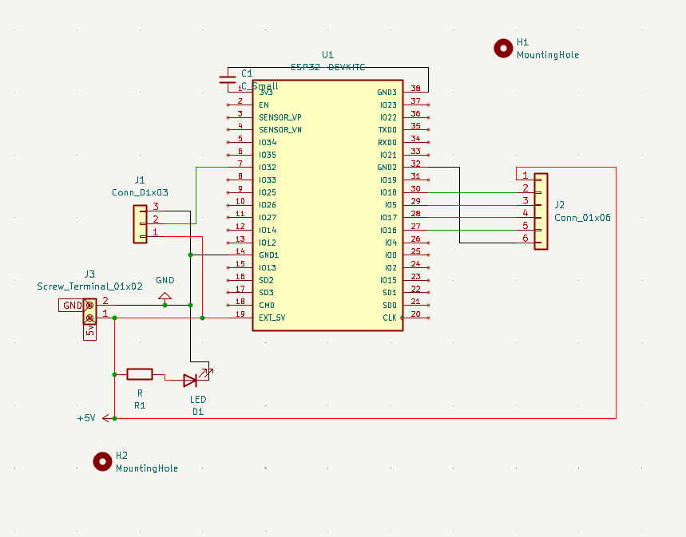
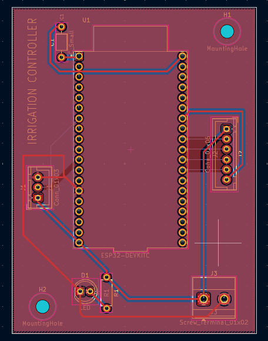
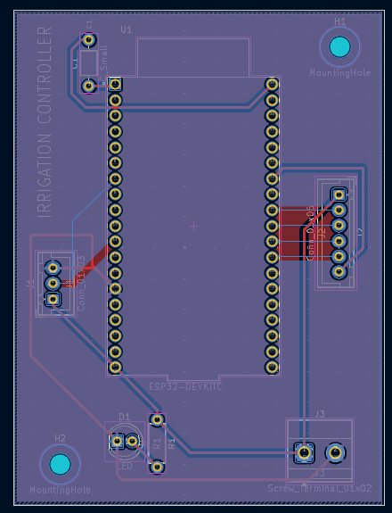
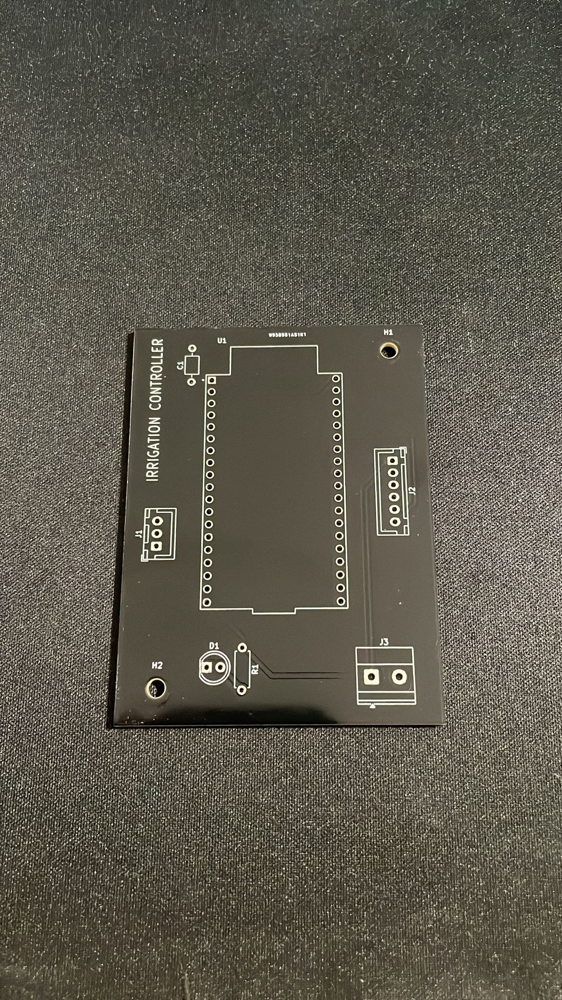
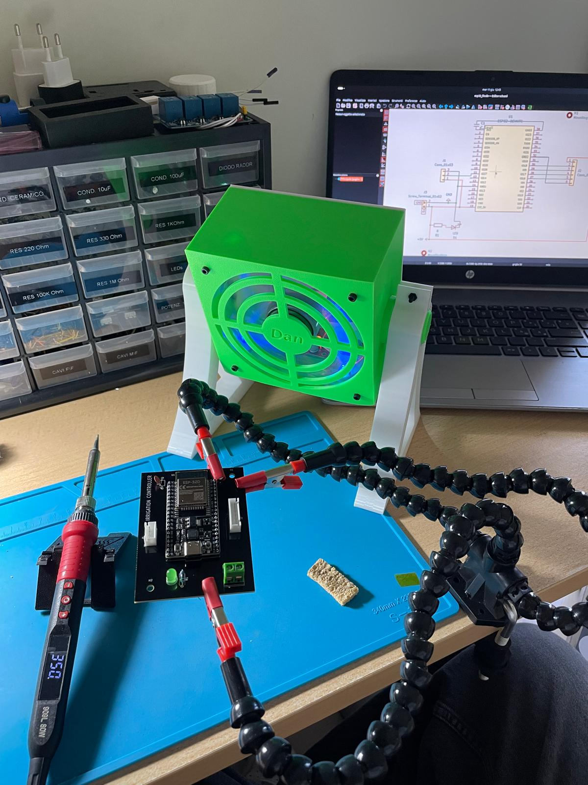
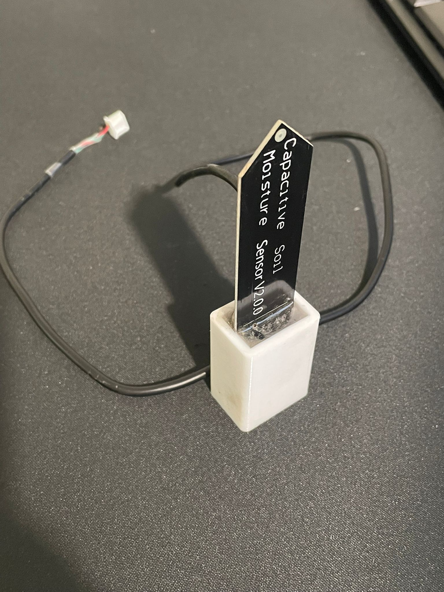

# Irrigation-Controller

## Introduction

This project stems from the need to automate the irrigation of my house's garden so as to make the job easier for my now elderly grandfather. To do this, I decided to build an irrigation control unit that would integrate perfectly with **Home Assistant** already in operation in my house.

## PCB and electrical components

*Caution: 230V mains current can be fatal, in case of doubt or uncertainty, consult a professional!*

First of all, I studied the electrical system, specifically the garden is divided into 3 zones each containing sprinklers controlled by a 24V AC solenoid valve. So as a first step, I installed a transformer that would allow me to obtain the desired voltage from the mains current. Once the power system was complete, I started to study the actual electrical system of the control unit.

The basic idea was to build a control unit consisting mainly of **three modules**:

- *Main board*

- *Relay board*

- *Soil moisture sensor*

There is one problem, however. The ESP32, relay board and sensor are powered by DC, not 24V AC. I therefore installed an AC-DC converter with 12V 5A DC output. 

At this point you may be asking yourself, *Why 12V? It is not possible to power the esp32 with this voltage.* The answer is simple, the relay board needs to be powered at 12V, so to power the esp32 we will need an additional step-down module. Specifically, I chose one based on the LM2596.

So I set to work and using KiCad I created the circuit diagram. 



- J1, will handle the soil moisture sensor.

- J2 will manage the relay board.

- D1 is simply a status LED.

- C1 is a decoupling capacitor, useful for reducing interference when supplying the board with external 5V.  It should be connected as close as possible to the 3.3V pin.

I then moved on to the modelling of the actual PCB.

 The board will consist of two layers, the upper one for current delivery and the lower one for signal transport. The tracks carrying current to the modules are 0.5mm while those carrying signals are 0.25mm. I then defined the 3mm mounting holes and inserted a ground plane both above and below the board.





Once I had completed the card, I sent it to print........and here it is!



Now that the board was with me, I started soldering all the components. Specifically:

- J3: TerminalBlock_Phoenix:TerminalBlock_Phoenix_MKDS-1,5-2-5.08_1x02_P5.08mm_Horizontal

- R1: 1k Ohm Resistor_THT:R_Axial_DIN0207_L6.3mm_D2.5mm_P7.62mm_Horizontal

- D1 5mm LED

- J1: Connector_JST:JST_XH_B3B-XH-A_1x03_P2.50mm_Vertical

- J2: Connector_JST:JST_XH_B6B-XH-A_1x06_P2.50mm_Vertical

- C1: Capacitor_THT:C_Axial_L3.8mm_D2.6mm_P7.50mm_Horizontal



The board is finally finished, after which I started thinking of a way to waterproof the soil moisture sensor so that it would withstand the elements.

In the end I modelled a box and printed it with my 3D printer using PETG.  I then inserted the critical part of the board inside and filled the box with epoxy resin.

And this is the end result.



All components are now ready to be assembled, I will not dwell much on the wiring of the cables as it is only a matter of connecting the solenoid valves to the relays and creating the power supply line to the board, which is very simple and basic.

The end result looks like this:


## ESPHome

Let us now discuss how to make the following board interface with Home Assistant. To do this, I decided to use the very powerful tool, **ESPHome**, thanks to which, via OTA, it is possible to update the board via WiFi without having to use the USB port each time.

So first, let's go to our esphome web interface and add a new device. It will create a new entity for us, open the .yaml file and as a first step, enter the SSID and password of our WiFi. Once this is done, we begin by defining our components.

```yaml
sensor:
  - platform: adc
 pin: GPIO32
 name: "Umidità del terreno (%)"
 update_interval: 30s
 attenuation: 11db
 filters:
      - calibrate_linear:
          - 2.66 -> 0.0
          - 1.080 -> 100.0
      - clamp:
 min_value: 0.0
 max_value: 100.0
 unit_of_measurement: "%"
 accuracy_decimals: 1
```

Values in calibrated linear, must be calculated beforehand. This can be done by immersing the sensor in completely wet soil, the value read out will represent “100%”, while to read the value of “0%” it will be enough to consider the value the sensor transmits without it being immersed in the soil. Each sensor may have different values, so you rely on yours.

```yaml
# Relays (binary switches)
switch:
  - platform: gpio
    name: "Relay 1"
    pin: GPIO18
    id: relay1

  - platform: gpio
    name: "Relay 2"
    pin: GPIO5
    id: relay2

  - platform: gpio
    name: "Relay 3"
    pin: GPIO17
    id: relay3
```

The configuration of relays, on the other hand, is very simple. Each entity will correspond to a button in Home Assistant that will allow each of the 3 solenoid valves to be powered or not.

Everything is ready, let's upload and check that the board is online, you can see any errors through the logs that esphome provides.

## Home assistant

Now open *Home Assistant -> Settings -> Devices and Services*. We should see our entity automatically recognised on the network by HA. In case it is not there, you can add it directly using its IP address.

Once our device has been added, the buttons to control the relays and the soil moisture percentage will be shown on the main dashboard. At this point we need to create the logic of an actual irrigation controller, to do this we will use the automations and partially modify the HA *configuration.yaml*.

First, we look for the HA configuration file and add the following entities to it.

```yaml
input_number:
  durata_irrigazione_zona_1:
    name: Durata irrigazione zona 1
    initial: 10
    min: 1
    max: 30
    step: 1
    unit_of_measurement: 'min'

  durata_irrigazione_zona_2:
    name: Durata irrigazione zona 2
    initial: 10
    min: 1
    max: 30
    step: 1
    unit_of_measurement: 'min'

  durata_irrigazione_zona_3:
    name: Durata irrigazione zona 3
    initial: 10
    min: 1
    max: 30
    step: 1
    unit_of_measurement: 'min'

timer:
  irrigazione_zona_1:
    duration: '00:05:00'
    name: Timer irrigazione zona 1

  irrigazione_zona_2:
    duration: '00:05:00'
    name: Timer irrigazione zona 2

  irrigazione_zona_3:
    duration: '00:05:00'
    name: Timer irrigazione zona 3

input_boolean:

  zona1_lunedi:
    name: Zona 1 - Lunedì
  zona1_martedi:
    name: Zona 1 - Martedì
  zona1_mercoledi:
    name: Zona 1 - Mercoledì
  zona1_giovedi:
    name: Zona 1 - Giovedì
  zona1_venerdi:
    name: Zona 1 - Venerdì
  zona1_sabato:
    name: Zona 1 - Sabato
  zona1_domenica:
    name: Zona 1 - Domenica

  zona2_lunedi:
    name: Zona 2 - Lunedì
  zona2_martedi:
    name: Zona 2 - Martedì
  zona2_mercoledi:
    name: Zona 2 - Mercoledì
  zona2_giovedi:
    name: Zona 2 - Giovedì
  zona2_venerdi:
    name: Zona 2 - Venerdì
  zona2_sabato:
    name: Zona 2 - Sabato
  zona2_domenica:
    name: Zona 2 - Domenica

  zona3_lunedi:
    name: Zona 3 - Lunedì
  zona3_martedi:
    name: Zona 3 - Martedì
  zona3_mercoledi:
    name: Zona 3 - Mercoledì
  zona3_giovedi:
    name: Zona 3 - Giovedì
  zona3_venerdi:
    name: Zona 3 - Venerdì
  zona3_sabato:
    name: Zona 3 - Sabato
  zona3_domenica:
    name: Zona 3 - Domenica

input_datetime:
  zona1_orario_avvio:
    name: Orario irrigazione Zona 1
    has_time: true
    has_date: false

  zona2_orario_avvio:
    name: Orario irrigazione Zona 2
    has_time: true
    has_date: false

  zona3_orario_avvio:
    name: Orario irrigazione Zona 3
    has_time: true
    has_date: false
```

These are all entities that will come in handy later to control our devices. **Restart home assistant.**

Four basic automations are provided for each zone:

- Turning on sprinklers

- Switching off sprinklers when timer expires

- Forced sprinkler shutdown

- Programmed start-up of sprinklers

Since the code of the automations of the 3 zones is the same, we will only study zone 1, as the others are easily replicable.

---

> In case you want to replicate the project, remember to use the exact name of your entities.

### Turning on sprinklers

```yaml
alias: "Accensione irrigatore zona 1 "
description: ""
triggers:
  - trigger: state
    entity_id:
      - switch.test_relay_3
    from: "off"
    to: "on"
conditions: []
actions:
  - target:
      entity_id: timer.irrigazione_zona_1
    data:
      duration: |
        {{ states('input_number.durata_irrigazione_zona_1') | int * 60 }}
    action: timer.start
mode: single
```

### Switching off sprinklers when timer expires

```yaml
alias: Spegnimento interruttore zona 1
description: ""
triggers:
  - trigger: event
    event_type: timer.finished
    event_data:
      entity_id: timer.irrigazione_zona_1
conditions: []
actions:
  - action: switch.turn_off
    metadata: {}
    data: {}
    target:
      entity_id: switch.test_relay_3
mode: single
```

### Forced sprinkler shutdown

```yaml
alias: Spegnimento forzato
description: ""
triggers:
  - trigger: state
    entity_id:
      - switch.test_relay_3
    from: "on"
    to: "off"
conditions: []
actions:
  - data:
      entity_id: timer.irrigazione_zona_1
    action: timer.cancel
mode: single
```

### Programmed start-up of sprink

```yaml
alias: Irrigazione automatica Zona 1
description: ""
triggers:
  - at: input_datetime.zona1_orario_avvio
    trigger: time
conditions:
  - condition: template
    value_template: |
        {{ giorni[oggi] == 'on' }}
actions:
  - target:
      entity_id: switch.test_relay_1
    action: switch.turn_on
    data: {}
  - delay:
      seconds: >-
        {{ (states('input_number.durata_irrigazione_zona_1') | float * 60) | int
        }}
  - target:
      entity_id: switch.test_relay_1
    action: switch.turn_off
    data: {}
mode: single
```

It is then possible to create a customised plate to facilitate sensor management, I specifically set it up like this.


Let's try it!


Home Assistant offers a way of customisation possibilities, and it is possible to add many other features to this system, such as notifications, automatic switch-on based on the humidity sensor and much more.

---

*Thank you all, see you at the next project.*
